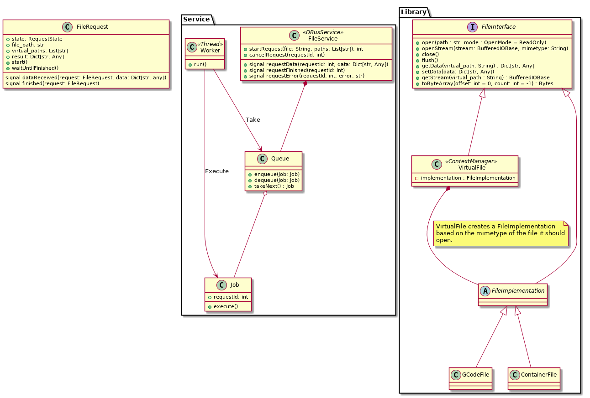

File Library
============

This library will read and write several 3D-printing related file formats.



Metadata
--------

Each file implementation is expected to provide some global metadata for the file and additionally some per-resource metadata. This metadata is represented as a list of key-value pairs, with the key being a virtual path to a specific metadata entry.

Each file implementation is required to provide the following metadata entries for all resources:

- size: Total file size. Note that when dealing with compressed files, this should be the uncompressed size.

For toolpath resources, the following metadata entries are also required to be provided:

- machine_type: The type of machine this toolpath targets.
- print_time: The time in seconds it is estimated this toolpath will take to print.
- print_size: A volume describing the total print size.

Additional metadata may be available but is not required.

### The Default Set

The default set of metadata as referenced below, contains the required properties for the entire file and the required properties for the default toolpath.

Virtual Paths
-------------

The metadata and stream properties of the file are retrieved based on paths. These paths represent virtual locations in the file and can be mapped by the file implementation to different locations or files in the container file. The library provides a method to list all the available virtual paths of a file.

The following virtual paths are guaranteed to be available:

- `/metadata` or `/metadata/default`: Retrieve a "default" set of metadata.
- `/toolpath` or `/toolpath/default`: Retrieve the primary or default toolpath.

The following virtual paths are optionally also available. These are considered optional because they can represent non-existing resources or capabilities the file format does not support. Client code should always check before using these resources.

- `/metadata/{key}`: Retrieve the named key from the file's metadata.
- `/metadata/{path}`: Retrieve metadata for a specific resource. {path} can be any valid virtual path except those starting with /metadata.
- `/preview` or `/preview/default`: Retrieve the default preview at a default size.
- `/preview/default/{size}`: Retrieve the default preview at the specified size.
- `/preview/{name}`: Retrieve the named preview.
- `/preview/{name}/{size}`: Retrieve the named preview at the specified size.
- `/toolpath/{name}`: Retrieve the named toolpath.
- `/{file path}`: Retrieve a named file.

Note that virtual paths are case-sensitive and should only contain alphanumeric characters, dots, underscores and forward slashes.

Examples
--------

To retrieve the default set of metadata, use `/metadata`. This would return a dictionary with something like:

```
{
    /metadata/size: 12354
    /metadata/toolpath/default/size: 12000
    /metadata/toolpath/default/machine_type: ultimaker3
    /metadata/toolpath/default/print_time: 121245
    /metadata/toolpath/default/print_size: (0,0,0)x(100,100,100)
}
```

To retrieve a stream for the preview named "top left" at a size of 117x117 pixels, use the path `/preview/top_left/117x117`.
